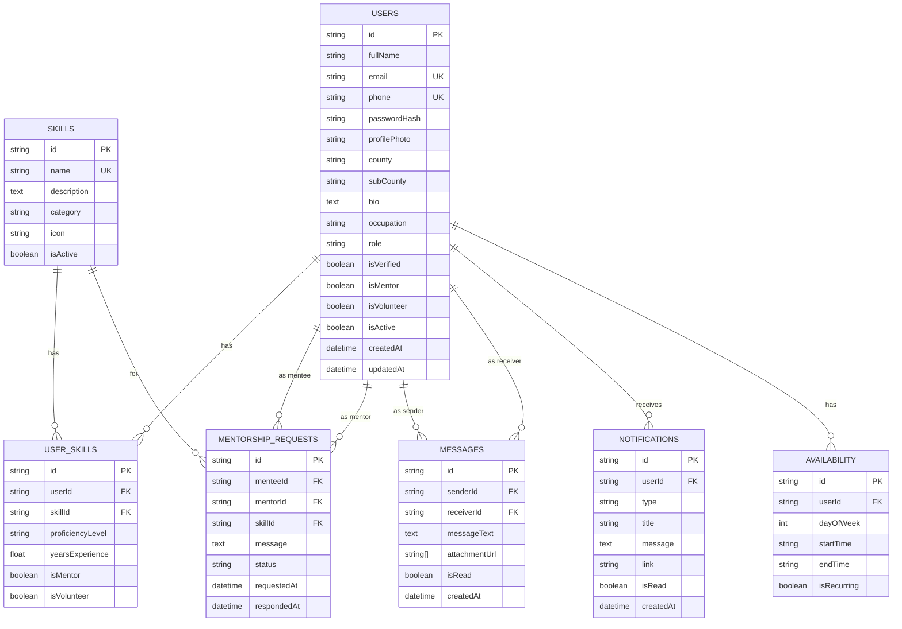

# ISDP Database Design

## Overview

The database uses PostgreSQL with Prisma ORM. The schema consists of 15+ tables organized around the core entities: Users, Skills, Mentorship, Messages, and Notifications.

## Entity Relationship Diagram
┌─────────────────────────────────────────────────────────────────────┐
│ │
│ users │
│ ┌─────────────────────────────────────────────────────────────┐ │
│ │ id, fullName, email, phone, passwordHash, profilePhoto │ │
│ │ county, subCounty, bio, occupation, role, isVerified │ │
│ │ isMentor, isVolunteer, isActive, emailVerified │ │
│ │ lastLogin, loginCount, createdAt, updatedAt │ │
│ └─────────────────────────────────────────────────────────────┘ │
│ │ │ │ │ │
│ ▼ ▼ ▼ ▼ │
│ ┌──────────┐ ┌──────────────┐ ┌───────────┐ ┌──────────────┐ │
│ │ user_ │ │ mentorship │ │ messages │ │ notifications │ │
│ │ skills │ │ _requests │ │ │ │ │ │
│ ├──────────┤ ├──────────────┤ ├───────────┤ ├──────────────┤ │
│ │ userId │ │ menteeId │ │ senderId │ │ userId │ │
│ │ skillId │ │ mentorId │ │ receiverId│ │ type │ │
│ │ level │ │ skillId │ │ message │ │ title │ │
│ │ exp │ │ status │ │ isRead │ │ message │ │
│ │ isMentor │ │ requestedAt │ │ createdAt │ │ isRead │ │
│ └──────────┘ └──────────────┘ └───────────┘ └──────────────┘ │
│ │ │ │
│ ▼ ▼ │
│ ┌──────────┐ ┌──────────────┐ │
│ │ skills │ │ mentorship │ │
│ ├──────────┤ │ _sessions │ │
│ │ id │ ├──────────────┤ │
│ │ name │ │ requestId │ │
│ │ category │ │ scheduledAt │ │
│ │ desc │ │ duration │ │
│ │ icon │ │ location │ │
│ └──────────┘ │ status │ │
│ └──────────────┘ │
│ │
└─────────────────────────────────────────────────────────────────────┘

text

## Core Tables

### 1. users

The main user table storing all account information.

| Column | Type | Description |
|--------|------|-------------|
| id | String (PK) | Unique user identifier |
| fullName | String | User's full name |
| email | String (Unique) | Email address |
| phone | String (Unique) | Phone number |
| passwordHash | String | Hashed password (bcrypt) |
| profilePhoto | String | URL to profile image |
| county | String | User's county |
| subCounty | String | User's sub-county |
| bio | String | User biography |
| occupation | String | Current occupation |
| role | String | User role (admin, mentor, user, etc.) |
| isVerified | Boolean | Whether user is verified |
| isMentor | Boolean | Whether user is a mentor |
| isVolunteer | Boolean | Whether user volunteers |
| isActive | Boolean | Whether account is active |
| emailVerified | Boolean | Whether email is verified |
| phoneVerified | Boolean | Whether phone is verified |
| lastLogin | DateTime | Last login timestamp |
| loginCount | Int | Total login count |
| createdAt | DateTime | Account creation date |
| updatedAt | DateTime | Last update date |
| deletedAt | DateTime | Soft delete date |

**Indexes:** email, phone, county, isMentor

---

### 2. skills

Available skills in the system.

| Column | Type | Description |
|--------|------|-------------|
| id | String (PK) | Unique skill identifier |
| name | String (Unique) | Skill name |
| description | String | Skill description |
| category | String | Skill category |
| icon | String | Icon identifier |
| isActive | Boolean | Whether skill is active |
| createdAt | DateTime | Creation date |
| updatedAt | DateTime | Last update date |

**Indexes:** name, category

---

### 3. user_skills

Links users to their skills.

| Column | Type | Description |
|--------|------|-------------|
| id | String (PK) | Unique identifier |
| userId | String (FK) | Reference to user |
| skillId | String (FK) | Reference to skill |
| proficiencyLevel | String | beginner/intermediate/advanced/expert |
| yearsExperience | Float | Years of experience |
| isMentor | Boolean | Mentor for this skill |
| isVolunteer | Boolean | Volunteer for this skill |
| verificationStatus | String | pending/verified/rejected |
| evidenceUrl | String[] | Evidence files |

**Indexes:** userId, skillId, isMentor

---

### 4. mentorship_requests

Mentorship request tracking.

| Column | Type | Description |
|--------|------|-------------|
| id | String (PK) | Unique identifier |
| menteeId | String (FK) | Person requesting mentorship |
| mentorId | String (FK) | Person being requested |
| skillId | String (FK) | Skill being mentored |
| message | String | Request message |
| status | String | pending/accepted/rejected/cancelled/completed |
| requestedAt | DateTime | Request creation date |
| respondedAt | DateTime | Response date |

---

### 5. mentorship_sessions

Scheduled mentorship sessions.

| Column | Type | Description |
|--------|------|-------------|
| id | String (PK) | Unique identifier |
| requestId | String (FK) | Associated request |
| mentorId | String (FK) | Mentor user |
| menteeId | String (FK) | Mentee user |
| scheduledAt | DateTime | Session date/time |
| durationMinutes | Int | Duration in minutes |
| locationType | String | physical/virtual/hybrid |
| locationDetail | String | Location details |
| status | String | scheduled/confirmed/in_progress/completed/cancelled |
| notes | String | Session notes |
| attended | Boolean | Whether attended |

---

### 6. messages

User-to-user messages.

| Column | Type | Description |
|--------|------|-------------|
| id | String (PK) | Unique identifier |
| senderId | String (FK) | Sending user |
| receiverId | String (FK) | Receiving user |
| messageText | String | Message content |
| attachmentUrl | String[] | Attached files |
| isRead | Boolean | Whether read |
| readAt | DateTime | When read |
| parentId | String | Parent message (replies) |
| createdAt | DateTime | Sent date |

---

### 7. notifications

System notifications.

| Column | Type | Description |
|--------|------|-------------|
| id | String (PK) | Unique identifier |
| userId | String (FK) | Target user |
| type | String | Notification type |
| title | String | Notification title |
| message | String | Notification content |
| link | String | Action link |
| isRead | Boolean | Whether read |
| readAt | DateTime | When read |
| sentAt | DateTime | When sent |
| createdAt | DateTime | Creation date |

---

### 8. availability

User availability for mentorship/volunteer work.

| Column | Type | Description |
|--------|------|-------------|
| id | String (PK) | Unique identifier |
| userId | String (FK) | User |
| dayOfWeek | Int | 0-6 (Sunday-Saturday) |
| startTime | String | HH:MM format |
| endTime | String | HH:MM format |
| isRecurring | Boolean | Whether recurring |
| effectiveFrom | DateTime | Start date |
| effectiveTo | DateTime | End date |

---

### 9. badges & user_badges

Gamification system.

**badges:**
| Column | Type | Description |
|--------|------|-------------|
| id | String (PK) | Unique identifier |
| name | String | Badge name |
| description | String | Badge description |
| icon | String | Icon identifier |
| criteria | String | How to earn |
| isAutomatic | Boolean | Automatically awarded |

**user_badges:**
| Column | Type | Description |
|--------|------|-------------|
| id | String (PK) | Unique identifier |
| userId | String (FK) | User |
| badgeId | String (FK) | Badge |
| awardedAt | DateTime | When awarded |
| expiresAt | DateTime | Expiration date |

---

### 10. activity_logs

Audit logging.

| Column | Type | Description |
|--------|------|-------------|
| id | String (PK) | Unique identifier |
| userId | String (FK) | User (optional) |
| action | String | Action performed |
| ipAddress | String | Client IP |
| userAgent | String | Browser agent |
| details | Json | Additional context |
| createdAt | DateTime | When occurred |

---

## Indexes for Performance

| Table | Index | Purpose |
|-------|-------|---------|
| users | email, phone | Fast login lookups |
| users | county | Location filtering |
| users | isMentor, isVolunteer | Role filtering |
| user_skills | userId, skillId | Fast skill lookups |
| mentorship_requests | mentorId, status | Mentor request queries |
| messages | senderId, receiverId | Chat queries |
| messages | createdAt | Message ordering |
| notifications | userId, isRead | Notification queries |

---

## Relationships Summary
User 1───* UserSkill ───1 Skill
User 1─── MentorRequest (as Mentee)
User 1───* MentorRequest (as Mentor)
User 1───* Message (as Sender)
User 1───* Message (as Receiver)
User 1───* Notification
User 1───* Availability
User 1───* Review (as Reviewer)
User 1───* Review (as Reviewed)

text

---

## Data Types

| Type | Description |
|------|-------------|
| String | Text fields |
| String (PK) | Primary key (cuid) |
| String (FK) | Foreign key |
| String (Unique) | Unique identifier (email, phone) |
| Int | Whole numbers |
| Float | Decimal numbers |
| Boolean | True/False |
| DateTime | Timestamp |
| Json | JSON object |
| String[] | Array of strings |

## Entity Relationship Diagram

